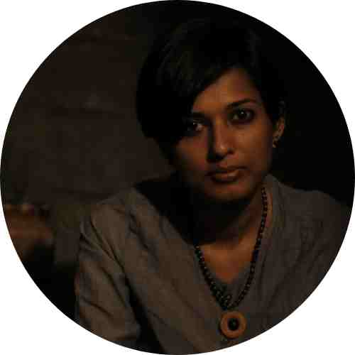
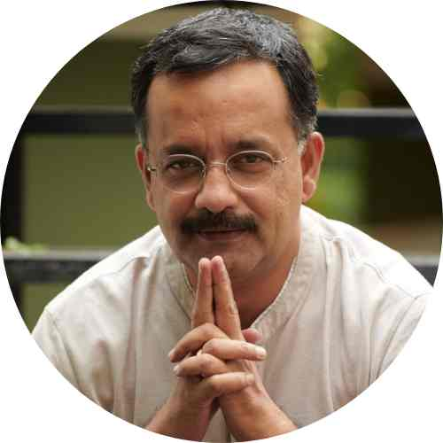
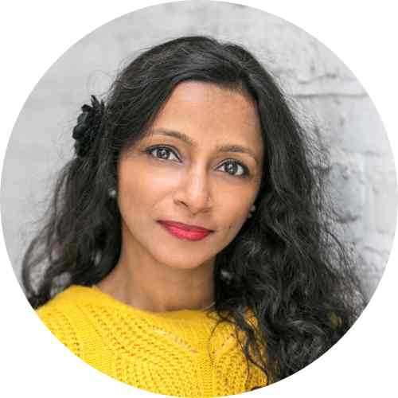

# About us

Welcome to Weaving Futures, where tradition meets innovation, and craftsmanship is reimagined.

## Our Story

Weaving Futures was born out of a shared passion for preserving the rich legacy of handloom weaving while embracing the endless possibilities of modern technology. Our journey began with a simple yet profound idea: to bridge the gap between time-honored traditions and the digital age, to empower artisans, and to create a thriving future for the art of handloom weaving.

## Our Mission

Our mission is twofold: to equip handloom craftsmen with cutting-edge tools and techniques, and to elevate handloom weaving to the status of a contemporary skill. We believe that the intricate patterns and vibrant stories woven into every textile deserve a platform where they can flourish and evolve, all the while paying homage to their roots.

## The Team

We are a diverse team, driven by our love for craftsmanship and our dedication to creating a more inclusive and sustainable future for traditional artisans. With a blend of expertise in industrial design, technology, and a profound understanding of the handloom and crafts sector, we work tirelessly to make Weaving Futures a reality.

<b>Nanditha Nair </b>- An industrious industrial designer with a vision to merge tradition and technology, Nanditha is an engineer and creative technologist. She has worked with handlooms for almost a decade. Headed the team that won industrial design awards.  Researching on Bio Materials at IAAC, Barcelona.

<b>Rajagopal Krishnan </b>- A passionate individual deeply rooted in the Indian handloom tradition, Raj was marketing strategist for 25+ years. He led Seematti and it's handloom journey, as it's brandhead. Initiated & executed Kancheepuram Sarees entry into the Guinness Book of world records. Launched Surya TV in Kerala.

<b> Mili Tharakan </b> - An enthusiast who brings an international perspective to our project, Mili is a seasoned inventor-business leader who has under her many IP innovations. She has expertise in smart textiles and technology with experience in bringing products to market. Mili is a board member of Smart Textile Alliance. She is based out of London.

## Our Collaborators

While we may not be registered as an organization, we are fortunate to have the invaluable support and guidance of INHAF, a non-profit dedicated to human settlements. This partnership strengthens our commitment to sustainable practices and ethical initiatives.

## Join Our Journey

Weaving Futures is more than a project; it's an invitation to join us on a transformative journey. We invite you to explore, learn, and create with us. As we weave the threads of tradition and innovation together, we hope to inspire, educate, and create a brighter future for handloom weaving.

Thank you for being a part of Weaving Futures. Together, we can craft a more vibrant, inclusive, and sustainable tomorrow.
