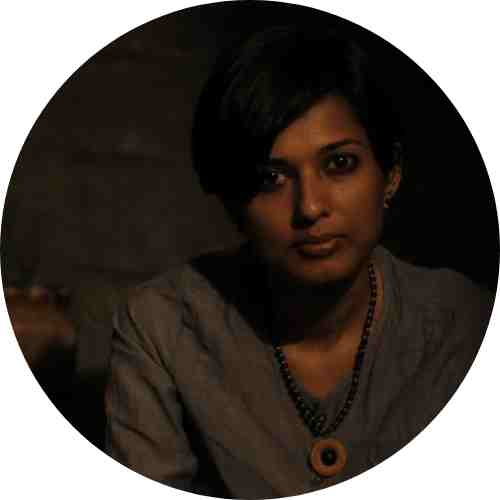
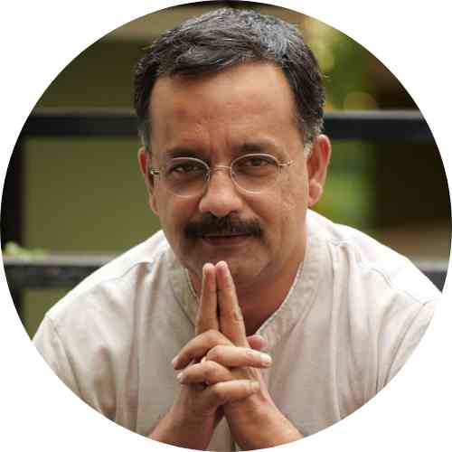
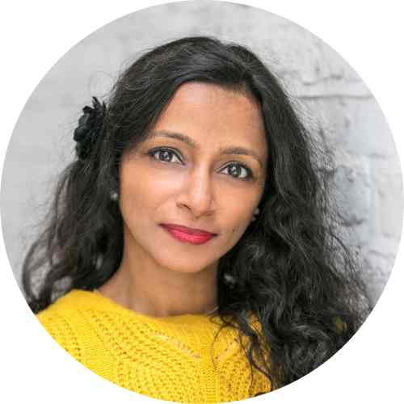

Welcome to Weaving Futures, where tradition meets innovation, and craftsmanship is reimagined.

## Our Story

Weaving Futures was born out of a shared passion for preserving the rich legacy of handloom weaving while embracing the endless possibilities of modern technology. Our journey began with a simple yet profound idea: to bridge the gap between time-honored traditions and the digital age, to empower artisans, and to create a thriving future for the art of handloom weaving.

## Our Mission

Our mission is twofold: to equip handloom craftsmen with cutting-edge tools and techniques, and to elevate handloom weaving to the status of a contemporary skill. We believe that the intricate patterns and vibrant stories woven into every textile deserve a platform where they can flourish and evolve, all the while paying homage to their roots.

## The Team

We are a diverse team, driven by our love for craftsmanship and our dedication to creating a more inclusive and sustainable future for traditional artisans. With a blend of expertise in industrial design, technology, and a profound understanding of the handloom and crafts sector, we work tirelessly to make Weaving Futures a reality.

<h3>Nanditha Nair</h3>

Nanditha crafts utility and beauty, combining traditional crafts with digital innovation. A media professional turned self-taught artisan, she's collaborated with various Indian handloom clusters. She is currently researching Bio Materials at IAAC, Barcelona. Nanditha drives our project, overseeing machines and materials – preserving the old and discovering the new.

 

<h3>Rajagopal V. Krishnan</h3>

Raj, with a deep connection to Indian handloom, is a seasoned marketing strategist with 25+ years' experience. Formerly the brand head for Seematti, he led their handloom journey, initiated & executed Kancheepuram Sarees' Guinness World Record entry, and launched Surya TV in Kerala. At Weaving Futures, Raj spearheads marketing to engage the next generation of weavers.

 

<h3>Mili John Tharakan</h3>

Mili, a textile artist with a global outlook, is an accomplished inventor and business leader with numerous IP innovations. Her smart textile and technology expertise, coupled with her experience in product development, makes her a valuable asset. As a board member of the Smart Textile Alliance in London, Mili leads our project in creating cutting-edge smart textile swatches and empowering weavers to embrace modernized weaving techniques.

 

## Our Collaborators

While we may not be registered as an organization, we are fortunate to have the invaluable support and guidance of INHAF, a non-profit dedicated to human settlements. This partnership strengthens our commitment to sustainable practices and ethical initiatives.

## Join Our Journey

Weaving Futures is more than a project; it's an invitation to join us on a transformative journey. We invite you to explore, learn, and create with us. As we weave the threads of tradition and innovation together, we hope to inspire, educate, and create a brighter future for handloom weaving.

Thank you for being a part of Weaving Futures. Together, we can craft a more vibrant, inclusive, and sustainable tomorrow.
