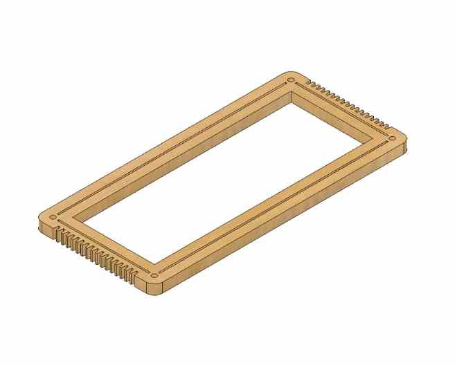

# Locket Loom

The Loom Necklace is a unique piece of jewelry that combines fashion with creativity. Crafted from delicate, thin wooden sheets, this necklace features a miniature loom at its center, which allows you to weave intricate patterns anywhere and at any time. The braided natural fiber string, with its adjustable length, adds an organic and rustic touch to the necklace. The loom itself comes with easy-to-follow instructions to weave four different patterns, making it accessible to both beginners and experienced weavers. With this one-of-a-kind accessory, you can let your creativity flow freely as you weave your own designs, whether you're at home or on the go. The Loom Necklace is not just a piece of jewelry; it's a wearable canvas for your artistic expression.

<!-- Slider main container -->

<!-- Additional required wrapper -->

    <!-- Slides -->
    
   
        

        

